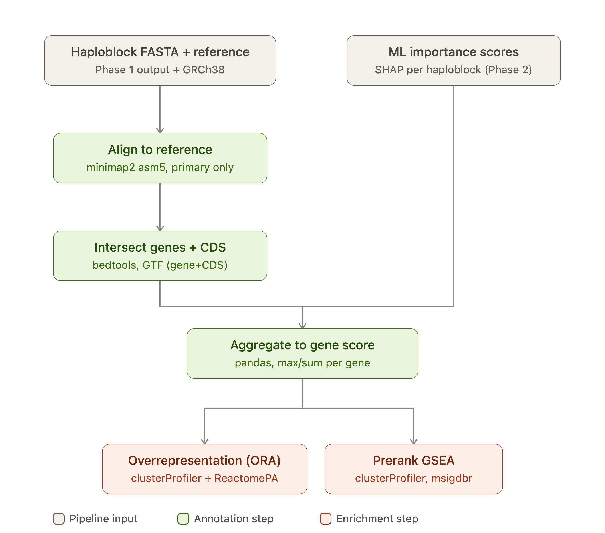
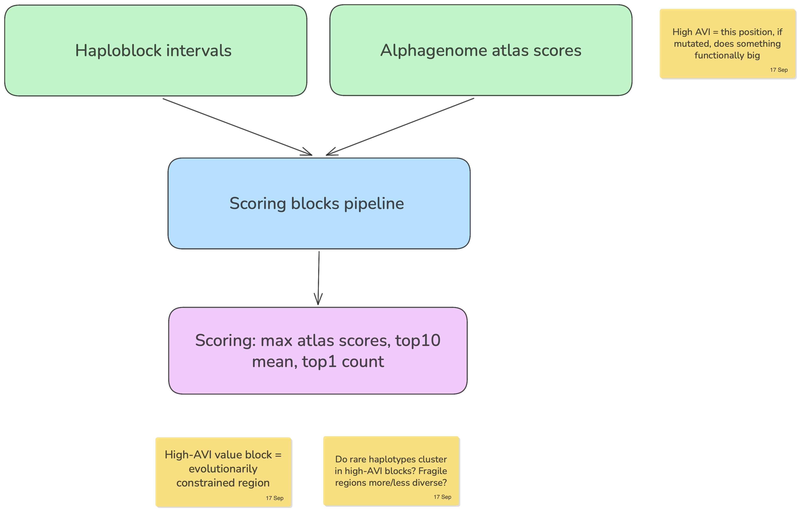

# HaploHash

Haploblock-level functional annotation + privacy-preserving genomic hashes. 16–18 Sep 2026.

```
39,141 haploblocks (hg38)   +   AlphaGenome Atlas | gnomAD
            \                          /
             \___ aggregate to block __/   top-1% statistic
                         |
               annotated haploblocks
                 /                \
           haplograph          64-bit hash
   nodes / edges / islands   S|CH:ROM|HAPLO|CLUSTER|VAR
      lift-weighted          re-identification attack
```





## The problem

Genomic data sharing sits on a tension: block-level haplotype structure carries strong functional
signal (regulatory activity, constraint, burden), but that same structure is exactly what makes
individuals re-identifiable across datasets. Existing mitigations either strip out the functional
signal (allele-frequency scrubbing) or leave the haplotype structure intact and exploitable.
There's no compact representation that keeps the former while resisting the latter.

## The idea

Treat each of the 39,141 hg38 haploblocks as the unit of both annotation and encoding:

1. **Annotate** every block with functional scores (AlphaGenome Atlas activity, gnomAD constraint)
   aggregated with a top-1% statistic, so the signal reflects the most extreme regulatory/constraint
   element in the block rather than a diluted mean.
2. **Encode** each annotated block into a 64-bit hash (`S|CHROM|HAPLO|CLUSTER|VAR`) that represents
   haplotype identity without exposing raw variant-level data.
3. **Attack** the hash scheme ourselves — treat re-identification as the adversarial baseline the
   encoding has to survive, not an afterthought.

## Scientific question

Can block-level functional annotation (AlphaGenome Atlas + gnomAD) predict effect sizes at the
haplotype level, and can a compact 64-bit hash encode enough haplotype signal for downstream
analysis (burden/SKAT/ACAT) while remaining resistant to re-identification attacks?

## How it works

**Features per block**

| Feature | Source | Note |
|---|---|---|
| `avi_top1` | Atlas AVI, Tabix | unsigned, permissive |
| `rnaseq_abs` | Atlas raw, API | signed — keep sum *and* abs |
| `gnocchi_mean` | gnomAD non-coding | positional, 1 kb |
| `loeuf_min` | gnomAD constraint | gene-joined; no gene = NA, not 0 |
| covariates | length, SNV density, coding fraction, genes |

Circular, excluded: PhastCons, Cactus, allele frequency (AVI inputs); recombination rate (defines
blocks).

**Data**: 1000G — 2,548 individuals, 26 populations, `data.haploblocks.org`. hg38, SNVs only. UKB
pending.

## How to use it

The end-to-end pipeline is **not ready yet**. What exists so far:

### `annotate_atlas/`

- Scrapes haploblock intervals from `data.haploblocks.org` into a sorted, overlap-checked
  `blocks.bed` (39,074 blocks recovered vs. 39,141 expected, hg38).
- `score_blocks.py` tabix-queries the AlphaGenome Atlas AVI PHRED scores per block, writing
  `block_scores.tsv` (`n_snv`, `avi_top1`, `avi_dens`, `length_kb`; PHRED ≥ 20, pooled, unsigned).
- **TODO**: AVI column indices need confirming against the real file once cluster VM access lands.

Downstream steps (haplograph construction, hash encoding, attack simulation, effect-size modeling)
are being built in parallel by the tracks below and are not yet wired together.

## Findings

_To be filled in as tracks report results._

## Team

| Who | Track |
|---|---|
| Mauricio Moldes | block filtering, gene counts |
| Alejandra Caballero, Mina | annotation databases, pruning |
| Markus Marandi | AlphaGenome atlas |
| Robert Campbell, David Bonet | effect sizes (burden / SKAT / ACAT) |
| Aditya Kumar Karna | encoding, hashing, hash attack |
